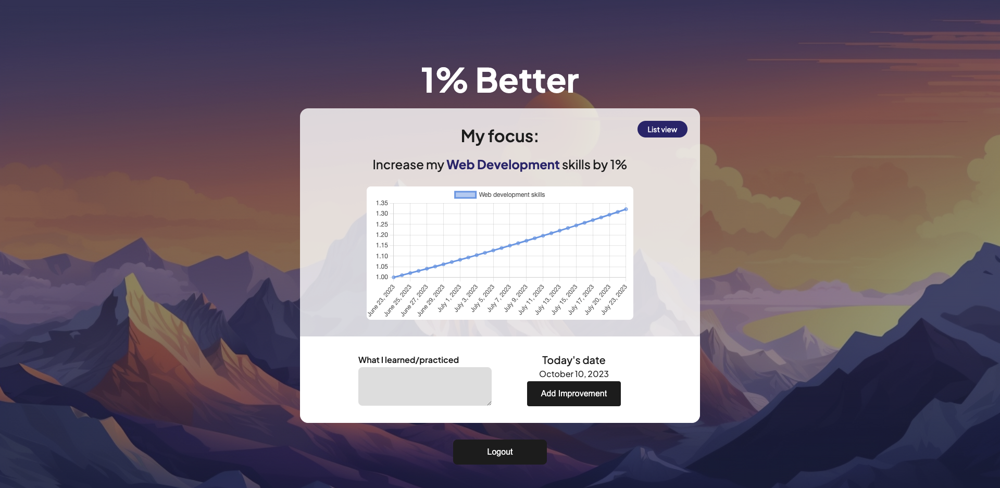

# One Percent Better

## Motivation

Growth Mindset is a skill that I actively practice every day. I wanted to create an application that would combine the ideas of Growth Mindset with the idea of 1% improvements in James Clear's book "Atomic Habits."

In One Percent Better, you can create areas, which are topics or skills you are actively trying to get better at. Each day, you can log what you practiced. When you click 'Add Improvement', a data point gets added showing your skills in that area increasing by 1%.

### Technologies Used

- React.js
- Next.js
- CSS
- MongoDB
- Apollo
- GraphQL
- JWT

---

## Installation

To install, clone the repository and run 'npm install'.

### List of Required Dependencies Needing Credentials

- MongoDB

## Credentials for Logging In

I created an account for users to test out. Here are those credentials:

> Login: testuser

> Password: password

## License

